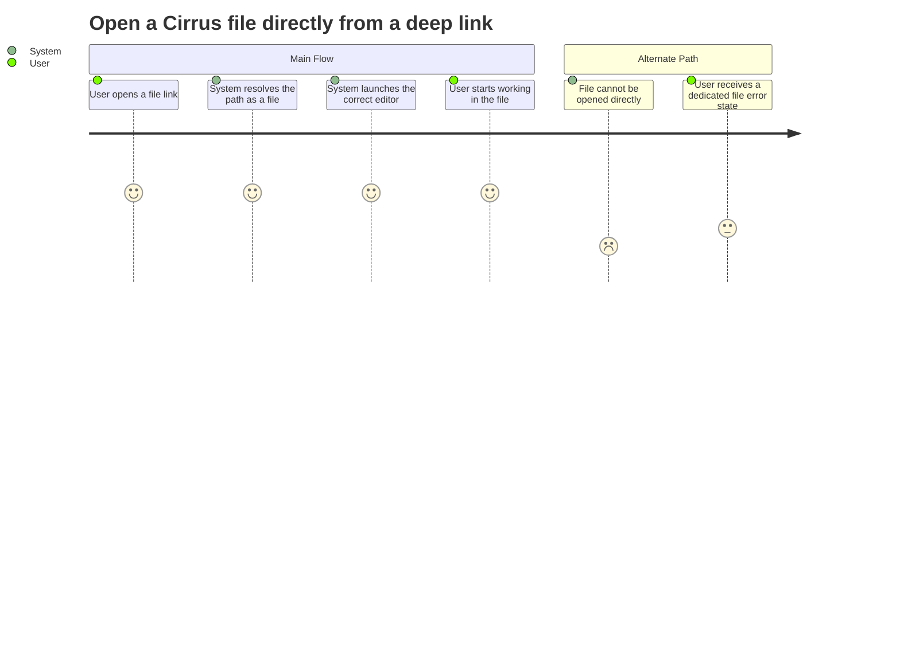

# Summary

Let a Cirrus user open a bookmarked or shared file URL and land directly in the right editor when the file is a valid editor-supported type.

# Persona

- Primary actor: Authenticated Cirrus user opening a shared file link
- Goal: Reach a specific file immediately without navigating through folders first
- Context: The user opens a URL such as `/cirrus/Documents/report.abdoc` from the browser or a shared message

# Trigger

The user loads a Cirrus URL that resolves to a file instead of a folder.

# Preconditions

1. The user is signed in and has access to the file.
2. The application can determine whether the requested path is a file and whether that file type is supported by an editor.

# Journey Steps

1. The user opens a direct Cirrus file URL.
2. The system resolves the path and identifies the target as a file.
3. The system opens the correct editor for that supported file type.
4. The user can immediately view or edit the file.

# Alternate/Failure Paths

1. The file path is invalid, stale, or unauthorized; the system shows a dedicated file error state and does not open an editor.
2. The file type is not supported anywhere in Cirrus; the system shows the same dedicated file error state instead of silently redirecting the user elsewhere.

# Success Outcome

Opening a valid deep link for an editor-supported file lands the user in the correct editor on first load.

# Metrics

- Success metric: Valid file deep links open the correct editor without manual navigation for any editor-supported file type.
- Guardrail metric: Direct file loads do not silently fail, silently redirect, or leave the user on an unrelated Cirrus state.

# Mermaid Journey Diagram

# Open Questions

1. What actions should the dedicated file error state offer: retry, open containing folder, go to root, or all three?
2. Should unsupported file types use the same message as invalid or unauthorized files, or should unsupported files explicitly say that no editor is available?

# Approval

- Approval Status: pending
- Approved By: pending
- Approved On: pending
- Notes: Derived from autobutler-org/autobutler#1048.
