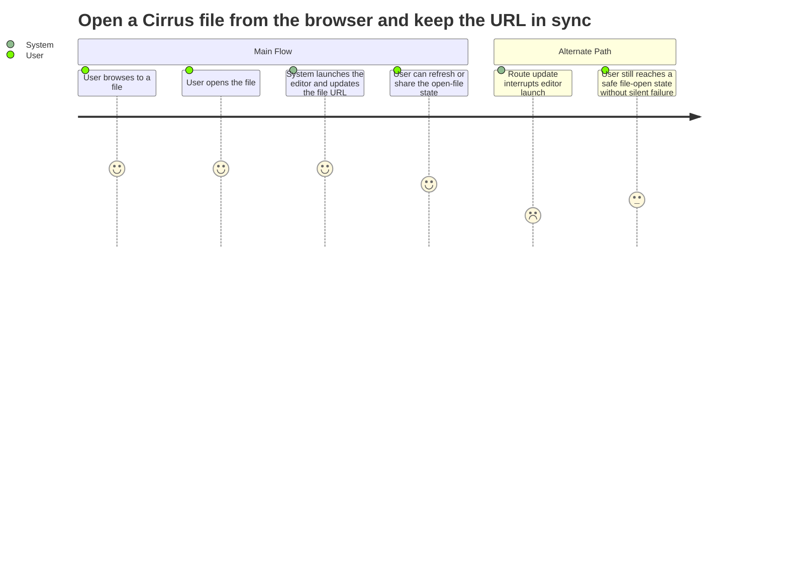

# Summary

Let a user open a file from Cirrus and have the browser URL update to that file, so the resulting editor state is bookmarkable, shareable, and consistent with browser navigation.

# Persona

- Primary actor: Authenticated user opening a file while browsing Cirrus
- Goal: Transition from folder browsing into a file editor without losing route fidelity
- Context: The user selects a file from the in-app file browser and expects the address bar to reflect the open file when the file is a valid type for the app's editors

# Trigger

The user opens a file from within Cirrus while already browsing folders.

# Preconditions

1. The user is signed in and has access to the selected file.
2. The app's editors can update the URL through a reliable route model, even if that model is interim rather than a final first-class `go_router` route architecture.

# Journey Steps

1. The user browses to a folder in Cirrus.
2. The user opens a file from that folder.
3. If the file type is editor-supported, the system transitions to the correct editor and updates the browser URL to the file path.
4. The user can refresh, bookmark, or share the open-file state.

# Alternate/Failure Paths

1. Route updates race with the editor transition; the system must not cancel the file-open action or silently return to the browser.
2. The selected file type is not supported by an editor or the interim routing model cannot preserve a reliable open-file state; the system must fail explicitly or fall back safely instead of silently dropping the file-open action.

# Success Outcome

Opening a file from Cirrus results in the correct editor state and a matching file URL.

# Metrics

- Success metric: Opening an editor-supported file from the browser updates the URL to the file path without interrupting editor launch.
- Guardrail metric: File-open actions do not fail silently during route transitions even when an interim route model is in use.

# Mermaid Journey Diagram

# Open Questions

1. What counts as "reliable enough" for the interim route model: refresh restore, bookmarkability, browser back/forward, or all three?
2. When a selected file is not supported by an editor, should the user stay in Cirrus with feedback or move to a dedicated error state?

# Approval

- Approval Status: pending
- Approved By: pending
- Approved On: pending
- Notes: Included because autobutler-org/autobutler#1048 calls for file-open URL sync for editor-supported file types.
