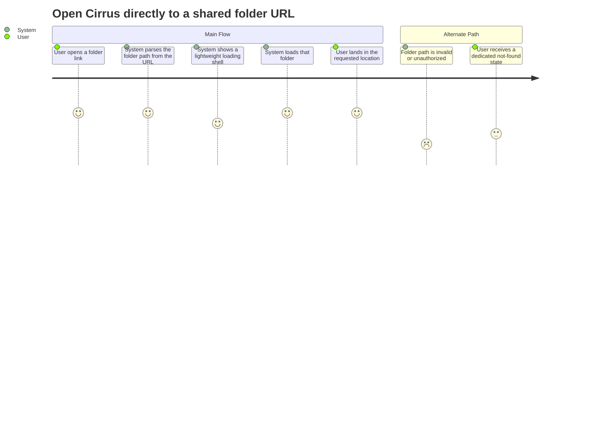

# Summary

Let a Cirrus user paste or open a bookmarked folder URL and land directly inside that folder instead of always starting at the root.

# Persona

- Primary actor: Authenticated Cirrus user following a bookmark or shared link
- Goal: Open a specific folder directly
- Context: The user receives or saves a folder URL and expects the browser to restore that exact location on load

# Trigger

The user loads a Cirrus URL that targets a non-root folder, such as `/cirrus/Documents/Projects`.

# Preconditions

1. The user is signed in and has access to the referenced folder.
2. Routing can parse and pass the requested folder path during app startup.

# Journey Steps

1. The user enters or opens a Cirrus folder URL in the browser.
2. The system parses the requested path from the route before rendering the page.
3. The system shows a lightweight loading shell while it resolves the targeted folder contents.
4. The system loads the targeted folder contents.
5. The user sees the requested folder and can continue browsing from there.

# Alternate/Failure Paths

1. The folder path is invalid or stale; the system shows a dedicated not-found/error state instead of silently falling back to another folder.
2. The user lacks permission to the target folder; the system denies access without exposing folder contents.

# Success Outcome

Opening a valid folder deep link lands the user in that exact folder with no manual navigation from root.

# Metrics

- Success metric: Valid Cirrus folder URLs load the targeted folder on first render.
- Guardrail metric: Invalid or unauthorized deep links fail safely without exposing other folder contents or silently redirecting elsewhere.

# Mermaid Journey Diagram

# Open Questions

1. What actions should the dedicated not-found state offer: go to root, go to parent, retry, or all three?
2. Should the loading shell include the requested folder path so users can confirm where the app is trying to take them?

# Approval

- Approval Status: pending
- Approved By: pending
- Approved On: pending
- Notes: Derived from autobutler-org/autobutler#1048.
