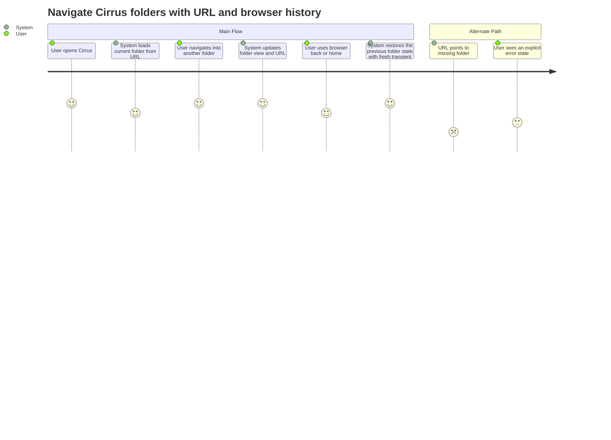

# Summary

Let a Cirrus user move through folders while the browser URL stays in sync, so back/forward, refresh, bookmarking, and sharing behave like a native web file browser.

# Persona

- Primary actor: Authenticated Cirrus user
- Goal: Browse nested folders without losing place or breaking browser navigation
- Context: The user is managing files in the web app and expects the address bar to reflect the current folder

# Trigger

The user opens Cirrus and navigates into or out of folders.

# Preconditions

1. The user is signed in and has access to Cirrus.
2. The selected folder path exists and is readable by the user.

# Journey Steps

1. The user opens Cirrus at `/cirrus` or an existing folder path.
2. The system loads the current folder and shows its contents.
3. The user opens a child folder, returns to root, or uses browser back/forward.
4. The system updates the URL to match the visible folder and restores the correct listing for each history step.
5. When the user moves through browser history, the system resets transient UI state like scroll position and selection for the newly restored folder view.

# Alternate/Failure Paths

1. The user navigates to a folder that no longer exists or is no longer accessible; the system shows an explicit error state and does not silently redirect the user to a different folder.
2. The user refreshes or uses browser back/forward during navigation; the system restores the folder represented by the URL instead of dropping back to root.

# Success Outcome

The visible Cirrus folder, browser URL, and browser history always represent the same location.

# Metrics

- Success metric: Folder navigation updates the URL and visible folder state on every navigation action.
- Guardrail metric: Refreshes and browser back/forward do not unexpectedly reset the user to `/cirrus` or silently reroute invalid folder URLs.

# Mermaid Journey Diagram

# Open Questions

1. What recovery actions should the explicit error state offer: retry, go to parent, go to root, or all three?
2. Should the home button always reset transient UI state even when the user is already at `/cirrus`?

# Approval

- Approval Status: pending
- Approved By: pending
- Approved On: pending
- Notes: Derived from autobutler-org/autobutler#1048.
